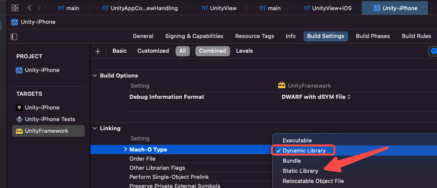
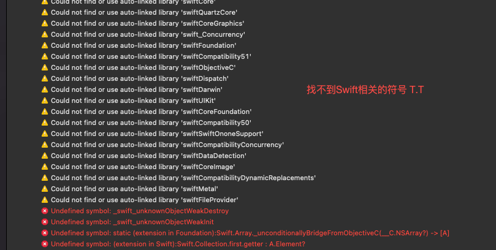

# 将UnityFramework编译成静态库

## 0x00 背景
在C语言中，一般从编写代码到最终得到**目标**平台可执行的程序需要经历以下过程。
```mermaid
graph LR;
    st(开始)-->PreCompile[预编译];
    PreCompile-->Compiling[编译];
    Compiling-->Assembly[汇编];
    Assembly-->linking[链接];
    linking-->en(结束);
```
1. 预编译：生成预编译文件-*.i(保留**pragma**) ```gcc -E src.c -o src.i```
2. 编译：生成汇编代码文件 *.s; ```gcc -S src.c -o src.s```
3. 汇编：将汇编代码编译成目标文件*.o文件 ```gcc -c src.c -o src.o```
4. 链接： 将目标文件组装到一起（地址和内存空间分配、符号决议、地址重定位等）生成最终的可执行文件

链接有2种方式：

1. 静态链接 (Unix-like 平台一般是 *.a文件，Windows: *.lib文件);**编译期间**将各个模块（一般是.o文件）组装成一个可执行文件或动态链接库文件
2. 动态链接 (Unix-like平台是*.so文件，Windows: *.dll文件)；**运行期间**将所需的模块装载进内存，并开始执行相关指令。

### 项目中遇到的问题
```mermaid
graph LR;
    main_proj(主工程)-->unity_proj(UnityFramework)
    main_proj-->libX(第三方库)
    unity_proj-->libX
```
以上是工程依赖关系图

目前Unity在Apple平台导出的xcodeproj默认设置成构建**动态库**。那就下来分析正常情况下这种依赖关系会存在什么问题？
1. 第三方库是 **静态库**
2. UnityFramework是 **动态库**


#### 存在的问题
* 出现符号_BZFooV重复的警告 Duplicate symbols，大概率运行时出现crash

1. 第三方库是 **动态库**
2. UnityFramework是 **静态库**


#### 存在的问题
* 必须在主工程中设置库A的依赖库B，否则在编译时出现``` undefined symbol xxx ```

## 0x01 问题

由于第三方库一般都是不可更改的，继续将Unity工程编译成动态库的话，必然会出现**重复符号**的问题。如何解决符号重定义问题呢？

## 0x02 方案以及遇到的问题

1. 可行的解决方案是将Unity编译成static UnityFramework.
首先按照下图所示将目标为UnityFramework的Mach-o Type从Dynamic Library改成Static Library 然后编译


可是很遗憾此时，提示如下错误：

从网上搜索相关的关键词即可，解决方案就是在Unity-iPhone目标 BuildPhase中的CompileSource添加一个空.swift 文件即可。或者直接复用Unity自动生成的**Dummy.swift**文件。

2. 解决链接错误后，编译成功，可以运行时出现如下错误：
"xxx unrecognized selector sent to instance 0x100...."这是由于UnityView+iOS.mm和UnityViewControllerBase+iOS.mm 在编译到UnityFramework静态库后，在可执行程序编译链接的过程中，因为**没有引用其引用的地方导致其代码块是一个孤岛** 从而编译器将其优化掉了。所以在Unity-iPhone的build phase中添加这两个源文件即可。

至此整个程序成功运行起来。棒极了！！！


## 0x03 引用
1. https://github.com/firebase/firebase-ios-sdk/blob/master/docs/firebase_in_libraries.md
2. 《程序员的自我修养——链接装载与库》